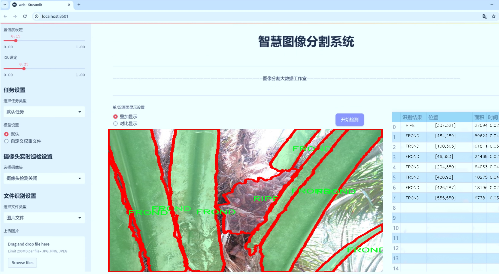
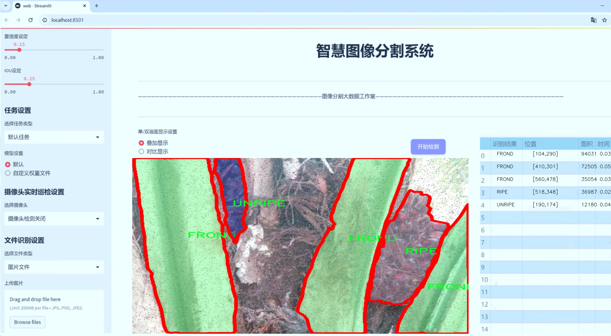
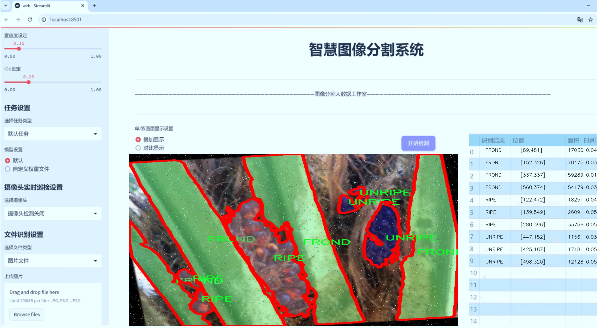
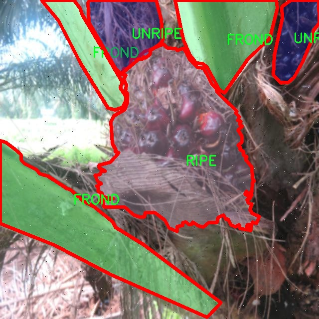
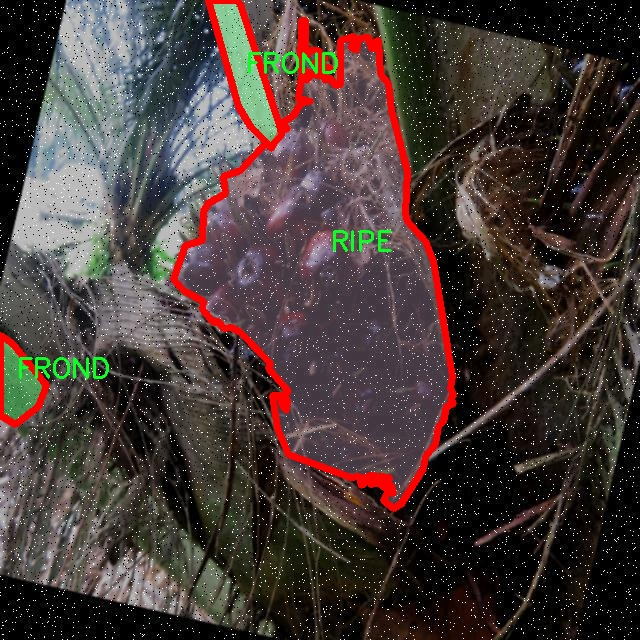
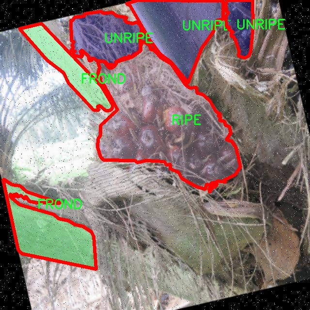
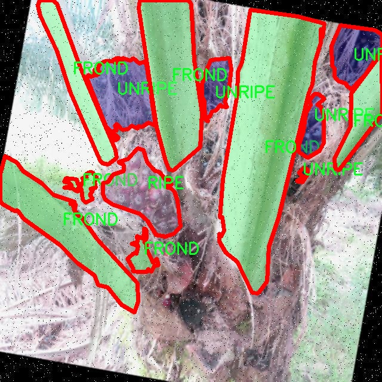
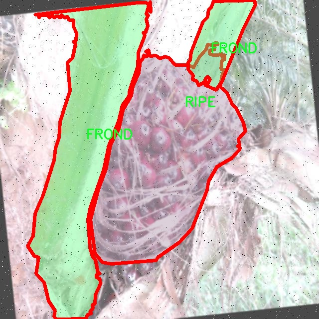

# Aura棕榈油果实分割系统： yolov8-seg-C2f-DCNV2-Dynamic

### 1.研究背景与意义

[参考博客](https://gitee.com/YOLOv8_YOLOv11_Segmentation_Studio/projects)

[博客来源](https://kdocs.cn/l/cszuIiCKVNis)

研究背景与意义

随着全球人口的持续增长和经济的发展，植物油的需求量日益增加，尤其是棕榈油，因其广泛应用于食品、化妆品及生物燃料等领域，成为了全球最重要的植物油之一。然而，棕榈油的生产往往伴随着环境问题，如森林砍伐、生物多样性丧失以及温室气体排放等。因此，如何提高棕榈油的生产效率，同时降低对环境的影响，成为了亟待解决的课题。在这一背景下，基于计算机视觉的农业智能化技术逐渐崭露头角，尤其是深度学习技术在图像识别和分割领域的应用，为棕榈油的精准农业管理提供了新的可能性。

本研究旨在开发一种基于改进YOLOv8的Aura棕榈油果实分割系统，利用先进的实例分割技术，对棕榈树上的不同成熟阶段的果实进行精确识别与分割。该系统的构建基于一个包含2300张图像的数据集，涵盖了四个主要类别：FROND（叶片）、RIPE（成熟果实）、STOICK（果实茎部）和UNRIPE（未成熟果实）。通过对这些类别的细致划分，研究不仅能够实现对棕榈果实的高效检测，还能为果实的成熟度分析提供数据支持，进而优化采摘时机，提高采摘效率。

改进YOLOv8模型的选择，源于其在实时目标检测和分割任务中的优越性能。YOLO系列模型以其高效的检测速度和较高的准确率，广泛应用于各种视觉任务。通过对YOLOv8进行改进，结合特定的棕榈果实特征，研究将进一步提升模型在复杂环境下的鲁棒性和适应性。这一改进不仅能提高分割精度，还能有效减少误检和漏检现象，为农业生产提供更为可靠的技术支持。

此外，Aura棕榈油果实分割系统的研究具有重要的现实意义。首先，它能够为棕榈油生产企业提供精准的果实监测和管理工具，帮助企业实现智能化管理，降低人工成本，提高生产效率。其次，该系统的应用将有助于推动可持续农业的发展，通过精确的果实成熟度分析，合理安排采摘时间，减少资源浪费，降低对环境的负面影响。最后，本研究的成果将为其他农作物的智能检测与管理提供借鉴，推动农业领域的数字化转型。

综上所述，基于改进YOLOv8的Aura棕榈油果实分割系统的研究，不仅是对计算机视觉技术在农业应用领域的一次创新探索，更是应对棕榈油生产挑战、推动可持续发展的重要举措。通过本研究的实施，期望能够为棕榈油产业的智能化、精准化管理提供有效的技术支持，助力实现经济效益与环境保护的双赢局面。

### 2.图片演示







注意：本项目提供完整的训练源码数据集和训练教程,由于此博客编辑较早,暂不提供权重文件（best.pt）,需要按照6.训练教程进行训练后实现上图效果。

### 3.视频演示

[3.1 视频演示](https://www.bilibili.com/video/BV1kRU2YaEYK/)

### 4.数据集信息

##### 4.1 数据集类别数＆类别名

nc: 4
names: ['FROND', 'RIPE', 'STOICK', 'UNRIPE']


##### 4.2 数据集信息简介

数据集信息展示

在本研究中，我们采用了名为“Aura Palm Oil detection”的数据集，以支持改进YOLOv8-seg的Aura棕榈油果实分割系统的训练和评估。该数据集专门设计用于棕榈油产业，旨在提高对不同成熟度果实的识别和分割能力，从而推动农业自动化和智能化的发展。数据集包含四个主要类别，分别是“FROND”（棕榈叶）、“RIPE”（成熟果实）、“STOICK”（未成熟果实）和“UNRIPE”（青果），这些类别的划分不仅有助于提高模型的准确性，也为后续的农业管理和收获决策提供了重要依据。

在数据集的构建过程中，研究团队收集了大量的棕榈油树图像，涵盖了不同生长阶段、不同光照条件和不同环境背景下的棕榈油树。这些图像经过精心标注，确保每个类别的样本数量和质量都达到一定标准，以便于模型的训练。数据集中的每一张图像都配有详细的标注信息，包括目标的边界框和类别标签，这为YOLOv8-seg模型的训练提供了丰富的监督信号。

数据集的多样性是其一大亮点，包含了来自不同地理位置和气候条件下的棕榈油树图像，这使得模型在面对各种实际应用场景时，能够展现出更强的适应性和鲁棒性。特别是在农业生产中，棕榈油树的生长受环境因素的影响较大，因此，数据集的多样性能够有效提高模型对环境变化的敏感度，进而提升果实分割的准确性。

此外，数据集还考虑到了不同成熟度果实的特征差异。成熟果实（RIPE）通常呈现出鲜艳的颜色和较大的体积，而未成熟果实（UNRIPE）则颜色较浅且体积较小。棕榈叶（FROND）作为背景元素，提供了丰富的纹理和颜色变化，这为模型的训练增加了难度，但同时也提升了模型的学习能力。通过这种方式，数据集不仅仅是简单的图像集合，而是一个综合考虑了目标特征、环境因素和实际应用需求的复杂系统。

在模型训练过程中，我们将数据集划分为训练集、验证集和测试集，以确保模型的泛化能力和稳定性。训练集用于模型的学习，验证集用于调参和模型选择，而测试集则用于最终的性能评估。通过这种科学的划分方式，我们能够全面评估模型在不同数据条件下的表现，从而为后续的实际应用提供可靠的技术支持。

总之，“Aura Palm Oil detection”数据集为改进YOLOv8-seg的Aura棕榈油果实分割系统提供了坚实的基础。通过对数据集的深入分析和合理利用，我们期望能够实现更高效、更准确的果实分割，推动棕榈油产业的智能化进程，最终实现农业生产的可持续发展。











### 5.项目依赖环境部署教程（零基础手把手教学）

[5.1 环境部署教程链接（零基础手把手教学）](https://www.bilibili.com/video/BV1jG4Ve4E9t/?vd_source=bc9aec86d164b67a7004b996143742dc)


[5.2 安装Python虚拟环境创建和依赖库安装视频教程链接（零基础手把手教学）](https://www.bilibili.com/video/BV1nA4VeYEze/?vd_source=bc9aec86d164b67a7004b996143742dc)

### 6.手把手YOLOV8-seg训练视频教程（零基础手把手教学）

[6.1 手把手YOLOV8-seg训练视频教程（零基础小白有手就能学会）](https://www.bilibili.com/video/BV1cA4VeYETe/?vd_source=bc9aec86d164b67a7004b996143742dc)


按照上面的训练视频教程链接加载项目提供的数据集，运行train.py即可开始训练



     Epoch   gpu_mem       box       obj       cls    labels  img_size
     1/200     0G   0.01576   0.01955  0.007536        22      1280: 100%|██████████| 849/849 [14:42<00:00,  1.04s/it]
               Class     Images     Labels          P          R     mAP@.5 mAP@.5:.95: 100%|██████████| 213/213 [01:14<00:00,  2.87it/s]
                 all       3395      17314      0.994      0.957      0.0957      0.0843

     Epoch   gpu_mem       box       obj       cls    labels  img_size
     2/200     0G   0.01578   0.01923  0.007006        22      1280: 100%|██████████| 849/849 [14:44<00:00,  1.04s/it]
               Class     Images     Labels          P          R     mAP@.5 mAP@.5:.95: 100%|██████████| 213/213 [01:12<00:00,  2.95it/s]
                 all       3395      17314      0.996      0.956      0.0957      0.0845

     Epoch   gpu_mem       box       obj       cls    labels  img_size
     3/200     0G   0.01561    0.0191  0.006895        27      1280: 100%|██████████| 849/849 [10:56<00:00,  1.29it/s]
               Class     Images     Labels          P          R     mAP@.5 mAP@.5:.95: 100%|███████   | 187/213 [00:52<00:00,  4.04it/s]
                 all       3395      17314      0.996      0.957      0.0957      0.0845


### 7.50+种全套YOLOV8-seg创新点加载调参实验视频教程（一键加载写好的改进模型的配置文件）

[7.1 50+种全套YOLOV8-seg创新点加载调参实验视频教程（一键加载写好的改进模型的配置文件）](https://www.bilibili.com/video/BV1Hw4VePEXv/?vd_source=bc9aec86d164b67a7004b996143742dc)

### YOLOV8-seg算法简介

原始YOLOV8-seg算法原理

YOLOv8-seg算法是YOLO系列中最新的一个重要版本，结合了目标检测与图像分割的功能，标志着计算机视觉领域的一次重要进步。与以往的YOLO版本相比，YOLOv8-seg在精度和速度上都实现了显著的提升，尤其是在复杂背景下的小目标检测和分割任务中展现出了强大的能力。其核心思想在于采用了anchor-free的方法，摒弃了传统的基于锚框的检测策略，从而提高了模型的检测精度和速度。这一转变使得YOLOv8-seg能够更好地适应动态变化的环境，尤其是在水面等复杂场景中。

YOLOv8-seg的网络结构主要由四个模块组成：输入端、主干网络、Neck端和输出端。输入端通过Mosaic数据增强、自适应图片缩放和灰度填充等方式对输入图像进行预处理，这一过程不仅提高了数据的多样性，还增强了模型的鲁棒性。主干网络则通过卷积、池化等操作提取图像特征，采用了更深的卷积神经网络结构，进一步提升了特征提取的能力。特别是C2fBF模块的引入，通过双层路由注意力机制，能够有效捕获远程依赖，保留细粒度的上下文信息，从而在特征提取过程中减少噪声影响。

在Neck端，YOLOv8-seg利用了PAN（Path Aggregation Network）结构，通过上采样、下采样和特征拼接的方式对不同尺度的特征图进行融合。这一设计不仅增强了模型对多尺度目标的感知能力，还提高了特征的表达能力。输出端则采用了decoupled head结构，实现了分类和回归过程的解耦，这一创新使得模型在处理复杂场景时能够更有效地进行目标检测与分割。为了进一步提升模型的性能，YOLOv8-seg在损失计算方面进行了优化，采用了BCE（Binary Cross-Entropy）计算分类损失，并引入了DFL（Distribution Focal Loss）和CIoU（Complete Intersection over Union）损失函数来计算回归损失。

尽管YOLOv8-seg在多方面表现出色，但在复杂水面环境下，仍然面临小目标检测的挑战。小目标漂浮物的特征复杂且背景多样，容易导致定位误差和目标感知能力不足。为了解决这些问题，YOLOv8-seg在设计上进行了多项改进。例如，添加了一个更小的检测头，以提升网络对小目标的感知力。此外，在Neck端引入了GSConv和Slim-neck技术，这不仅保持了检测精度，还有效降低了计算量，从而提高了模型的实时性。

YOLOv8-seg的创新之处还在于损失函数的设计。通过使用MPDIoU（Multi-Scale Partial Distance Intersection over Union）损失函数替代传统的CIoU损失函数，模型的泛化能力和精准度得到了显著提升。这一改进使得YOLOv8-seg在处理复杂背景和小目标时，能够更好地适应环境变化，提升了检测的稳定性和可靠性。

总的来说，YOLOv8-seg算法通过引入先进的网络结构和创新的技术手段，极大地提升了目标检测与分割的性能。其在处理复杂场景中的表现，尤其是在小目标检测方面的能力，标志着YOLO系列算法的一次重要飞跃。随着YOLOv8-seg的应用范围不断扩大，其在智能监控、自动驾驶、农业监测等领域的潜力也将不断被挖掘。未来，YOLOv8-seg有望在更多实际应用中发挥重要作用，为计算机视觉领域带来新的机遇与挑战。


### 9.系统功能展示（检测对象为举例，实际内容以本项目数据集为准）

图9.1.系统支持检测结果表格显示

  图9.2.系统支持置信度和IOU阈值手动调节

  图9.3.系统支持自定义加载权重文件best.pt(需要你通过步骤5中训练获得)

  图9.4.系统支持摄像头实时识别

  图9.5.系统支持图片识别

  图9.6.系统支持视频识别

  图9.7.系统支持识别结果文件自动保存

  图9.8.系统支持Excel导出检测结果数据


### 10.50+种全套YOLOV8-seg创新点原理讲解（非科班也可以轻松写刊发刊，V11版本正在科研待更新）

#### 10.1 由于篇幅限制，每个创新点的具体原理讲解就不一一展开，具体见下列网址中的创新点对应子项目的技术原理博客网址【Blog】：


[10.1 50+种全套YOLOV8-seg创新点原理讲解链接](https://gitee.com/qunmasj/good)

#### 10.2 部分改进模块原理讲解(完整的改进原理见上图和技术博客链接)【如果此小节的图加载失败可以通过CSDN或者Github搜索该博客的标题访问原始博客，原始博客图片显示正常】

### Gold-YOLO简介
YOLO再升级：华为诺亚提出Gold-YOLO，聚集-分发机制打造新SOTA
在过去的几年中，YOLO系列模型已经成为实时目标检测领域的领先方法。许多研究通过修改架构、增加数据和设计新的损失函数，将基线推向了更高的水平。然而以前的模型仍然存在信息融合问题，尽管特征金字塔网络（FPN）和路径聚合网络（PANet）已经在一定程度上缓解了这个问题。因此，本研究提出了一种先进的聚集和分发机制（GD机制），该机制通过卷积和自注意力操作实现。这种新设计的模型被称为Gold-YOLO，它提升了多尺度特征融合能力，在所有模型尺度上实现了延迟和准确性的理想平衡。此外，本文首次在YOLO系列中实现了MAE风格的预训练，使得YOLO系列模型能够从无监督预训练中受益。Gold-YOLO-N在COCO val2017数据集上实现了出色的39.9% AP，并在T4 GPU上实现了1030 FPS，超过了之前的SOTA模型YOLOv6-3.0-N，其FPS相似，但性能提升了2.4%。


#### Gold-YOLO


YOLO系列的中间层结构采用了传统的FPN结构，其中包含多个分支用于多尺度特征融合。然而，它只充分融合来自相邻级别的特征，对于其他层次的信息只能间接地进行“递归”获取。

传统的FPN结构在信息传输过程中存在丢失大量信息的问题。这是因为层之间的信息交互仅限于中间层选择的信息，未被选择的信息在传输过程中被丢弃。这种情况导致某个Level的信息只能充分辅助相邻层，而对其他全局层的帮助较弱。因此，整体上信息融合的有效性可能受到限制。
为了避免在传输过程中丢失信息，本文采用了一种新颖的“聚集和分发”机制（GD），放弃了原始的递归方法。该机制使用一个统一的模块来收集和融合所有Level的信息，并将其分发到不同的Level。通过这种方式，作者不仅避免了传统FPN结构固有的信息丢失问题，还增强了中间层的部分信息融合能力，而且并没有显著增加延迟。


# 8.低阶聚合和分发分支 Low-stage gather-and-distribute branch
从主干网络中选择输出的B2、B3、B4、B5特征进行融合，以获取保留小目标信息的高分辨率特征。


低阶特征对齐模块 (Low-stage feature alignment module)： 在低阶特征对齐模块（Low-FAM）中，采用平均池化（AvgPool）操作对输入特征进行下采样，以实现统一的大小。通过将特征调整为组中最小的特征大小（ R B 4 = 1 / 4 R ） （R_{B4} = 1/4R）（R 
B4 =1/4R），我们得到对齐后的特征F a l i g n F_{align}F align 。低阶特征对齐技术确保了信息的高效聚合，同时通过变换器模块来最小化后续处理的计算复杂性。其中选择 R B 4 R_{B4}R B4 作为特征对齐的目标大小主要基于保留更多的低层信息的同时不会带来较大的计算延迟。
低阶信息融合模块(Low-stage information fusion module)： 低阶信息融合模块（Low-IFM）设计包括多层重新参数化卷积块（RepBlock）和分裂操作。具体而言，RepBlock以F a l i g n ( c h a n n e l = s u m ( C B 2 ， C B 3 ， C B 4 ， C B 5 ) ) F_{align} (channel= sum(C_{B2}，C_{B3}，C_{B4}，C_{B5}))F align (channel=sum(C B2 ，C B3 ，C B4 ，C B5 )作为输入，并生成F f u s e ( c h a n n e l = C B 4 + C B 5 ) F_{fuse} (channel= C_{B4} + C_{B5})F fuse (channel=C B4 +C B5 )。其中中间通道是一个可调整的值（例如256），以适应不同的模型大小。由RepBlock生成的特征随后在通道维度上分裂为F i n j P 3 Finj_P3Finj P 3和F i n j P 4 Finj_P4Finj P 4，然后与不同级别的特征进行融合。


# 8.高阶聚合和分发分支 High-stage gather-and-distribute branch
高级全局特征对齐模块（High-GD）将由低级全局特征对齐模块（Low-GD）生成的特征{P3, P4, P5}进行融合。


高级特征对齐模块(High-stage feature alignment module)： High-FAM由avgpool组成，用于将输入特征的维度减小到统一的尺寸。具体而言，当输入特征的尺寸为{R P 3 R_{P3}R P3 , R P 4 R_{P4}R P4 , R P 5 R_{P 5}R P5 }时，avgpool将特征尺寸减小到该特征组中最小的尺寸（R P 5 R_{P5}R P5  = 1/8R）。由于transformer模块提取了高层次的信息，池化操作有助于信息聚合，同时降低了transformer模块后续步骤的计算需求。

Transformer融合模块由多个堆叠的transformer组成，transformer块的数量为L。每个transformer块包括一个多头注意力块、一个前馈网络（FFN）和残差连接。采用与LeViT相同的设置来配置多头注意力块，使用16个通道作为键K和查询Q的头维度，32个通道作为值V的头维度。为了加速推理过程，将层归一化操作替换为批归一化，并将所有的GELU激活函数替换为ReLU。为了增强变换器块的局部连接，在两个1x1卷积层之间添加了一个深度卷积层。同时，将FFN的扩展因子设置为2，以在速度和计算成本之间取得平衡。

信息注入模块(Information injection module)： 高级全局特征对齐模块（High-GD）中的信息注入模块与低级全局特征对齐模块（Low-GD）中的相同。在高级阶段，局部特征（Flocal）等于Pi，因此公式如下所示：


### 增强的跨层信息流动 Enhanced cross-layer information flow
为了进一步提升性能，从YOLOv8 中的PAFPN模块中得到启发，引入了Inject-LAF模块。该模块是注入模块的增强版，包括了一个轻量级相邻层融合（LAF）模块，该模块被添加到注入模块的输入位置。为了在速度和准确性之间取得平衡，设计了两个LAF模型：LAF低级模型和LAF高级模型，分别用于低级注入（合并相邻两层的特征）和高级注入（合并相邻一层的特征）。它们的结构如图5(b)所示。为了确保来自不同层级的特征图与目标大小对齐，在实现中的两个LAF模型仅使用了三个操作符：双线性插值（上采样过小的特征）、平均池化（下采样过大的特征）和1x1卷积（调整与目标通道不同的特征）。模型中的LAF模块与信息注入模块的结合有效地平衡了准确性和速度之间的关系。通过使用简化的操作，能够增加不同层级之间的信息流路径数量，从而提高性能而不显著增加延迟。


### 11.项目核心源码讲解（再也不用担心看不懂代码逻辑）

#### 11.1 ultralytics\utils\loss.py

以下是经过简化和注释的核心代码部分，主要包括损失函数的实现。代码中保留了主要的类和方法，并添加了详细的中文注释，以帮助理解其功能和逻辑。

```python
import torch
import torch.nn as nn
import torch.nn.functional as F
import math

class SlideLoss(nn.Module):
    def __init__(self, loss_fcn):
        """
        初始化 SlideLoss 类，接受一个损失函数作为参数。
        """
        super(SlideLoss, self).__init__()
        self.loss_fcn = loss_fcn
        self.reduction = loss_fcn.reduction
        self.loss_fcn.reduction = 'none'  # 需要对每个元素应用 SL

    def forward(self, pred, true, auto_iou=0.5):
        """
        计算滑动损失。
        :param pred: 预测值
        :param true: 真实值
        :param auto_iou: 自动 IoU 阈值
        :return: 计算后的损失
        """
        loss = self.loss_fcn(pred, true)  # 计算基础损失
        # 限制 auto_iou 的最小值
        if auto_iou < 0.2:
            auto_iou = 0.2
        
        # 计算调制权重
        b1 = true <= auto_iou - 0.1
        a1 = 1.0
        b2 = (true > (auto_iou - 0.1)) & (true < auto_iou)
        a2 = math.exp(1.0 - auto_iou)
        b3 = true >= auto_iou
        a3 = torch.exp(-(true - 1.0))
        
        # 组合调制权重
        modulating_weight = a1 * b1 + a2 * b2 + a3 * b3
        loss *= modulating_weight  # 应用调制权重到损失
        
        # 根据 reduction 类型返回损失
        if self.reduction == 'mean':
            return loss.mean()
        elif self.reduction == 'sum':
            return loss.sum()
        else:  # 'none'
            return loss

class BboxLoss(nn.Module):
    def __init__(self, reg_max, use_dfl=False):
        """
        初始化 BboxLoss 类，设置最大正则化值和 DFL 使用标志。
        :param reg_max: 最大正则化值
        :param use_dfl: 是否使用 DFL
        """
        super().__init__()
        self.reg_max = reg_max
        self.use_dfl = use_dfl

    def forward(self, pred_dist, pred_bboxes, anchor_points, target_bboxes, target_scores, target_scores_sum, fg_mask):
        """
        计算边界框损失。
        :param pred_dist: 预测的分布
        :param pred_bboxes: 预测的边界框
        :param anchor_points: 锚点
        :param target_bboxes: 目标边界框
        :param target_scores: 目标分数
        :param target_scores_sum: 目标分数总和
        :param fg_mask: 前景掩码
        :return: 计算后的损失
        """
        weight = target_scores.sum(-1)[fg_mask].unsqueeze(-1)  # 计算权重
        iou = bbox_iou(pred_bboxes[fg_mask], target_bboxes[fg_mask], xywh=False, CIoU=True)  # 计算 IoU
        loss_iou = ((1.0 - iou) * weight).sum() / target_scores_sum  # IoU 损失

        # DFL 损失
        if self.use_dfl:
            target_ltrb = bbox2dist(anchor_points, target_bboxes, self.reg_max)  # 转换目标边界框
            loss_dfl = self._df_loss(pred_dist[fg_mask].view(-1, self.reg_max + 1), target_ltrb[fg_mask]) * weight
            loss_dfl = loss_dfl.sum() / target_scores_sum
        else:
            loss_dfl = torch.tensor(0.0).to(pred_dist.device)

        return loss_iou, loss_dfl  # 返回 IoU 损失和 DFL 损失

    @staticmethod
    def _df_loss(pred_dist, target):
        """
        计算分布焦点损失 (DFL)。
        :param pred_dist: 预测的分布
        :param target: 目标值
        :return: DFL 损失
        """
        tl = target.long()  # 目标左侧
        tr = tl + 1  # 目标右侧
        wl = tr - target  # 左侧权重
        wr = 1 - wl  # 右侧权重
        return (F.cross_entropy(pred_dist, tl.view(-1), reduction='none').view(tl.shape) * wl +
                F.cross_entropy(pred_dist, tr.view(-1), reduction='none').view(tl.shape) * wr).mean(-1, keepdim=True)

class v8DetectionLoss:
    def __init__(self, model):
        """
        初始化 v8DetectionLoss 类，设置模型相关属性和损失函数。
        :param model: 训练的模型
        """
        device = next(model.parameters()).device  # 获取模型设备
        h = model.args  # 超参数

        m = model.model[-1]  # Detect() 模块
        self.bce = nn.BCEWithLogitsLoss(reduction='none')  # 二元交叉熵损失
        self.hyp = h
        self.stride = m.stride  # 模型步幅
        self.nc = m.nc  # 类别数量
        self.reg_max = m.reg_max
        self.device = device

        self.bbox_loss = BboxLoss(m.reg_max - 1).to(device)  # 边界框损失实例

    def __call__(self, preds, batch):
        """
        计算损失并返回。
        :param preds: 预测值
        :param batch: 批次数据
        :return: 总损失和分离的损失
        """
        loss = torch.zeros(3, device=self.device)  # box, cls, dfl
        pred_scores = preds[1]  # 预测分数

        # 目标处理
        targets = torch.cat((batch['batch_idx'].view(-1, 1), batch['cls'].view(-1, 1), batch['bboxes']), 1)
        gt_labels, gt_bboxes = targets.split((1, 4), 2)  # 类别和边界框

        # 计算边界框损失
        pred_bboxes = self.bbox_decode(pred_scores)  # 解码预测边界框
        loss[0], loss[2] = self.bbox_loss(pred_scores, pred_bboxes, gt_bboxes)  # 计算损失

        return loss.sum(), loss.detach()  # 返回总损失和分离的损失

    def bbox_decode(self, pred_scores):
        """
        解码预测的边界框坐标。
        :param pred_scores: 预测分数
        :return: 解码后的边界框
        """
        # 这里可以添加解码逻辑
        return pred_scores  # 返回解码后的边界框（示例）

# 其他损失类可以类似处理，保持核心逻辑并添加必要的注释
```

在这个简化的版本中，保留了 `SlideLoss`、`BboxLoss` 和 `v8DetectionLoss` 类的核心功能，并对每个方法进行了详细的中文注释，以帮助理解每个部分的作用。其他类（如 `KeypointLoss`、`v8SegmentationLoss` 等）可以按照类似的方式进行处理。

这个文件是Ultralytics YOLO模型中的损失函数实现，主要用于目标检测、分割和关键点检测等任务。代码中定义了多个损失类，每个类负责计算特定类型的损失。首先，导入了必要的库，包括PyTorch和一些Ultralytics的工具函数和指标。

`SlideLoss`类实现了一种滑动损失函数，它通过调整损失的权重来适应不同的IoU（Intersection over Union）阈值。它的构造函数接收一个损失函数，并将其减小到每个元素的损失。`forward`方法计算损失，并根据IoU的值调整损失的权重。

`EMASlideLoss`类类似于`SlideLoss`，但它使用指数移动平均来平滑IoU值，以便在训练过程中动态调整损失的权重。

`VarifocalLoss`类实现了一种变焦损失函数，使用了预测分数和真实分数来计算损失。它通过加权的方式来增强对难以分类样本的关注。

`FocalLoss`类是另一种损失函数，它通过调整样本的权重来解决类别不平衡问题。它通过计算每个样本的交叉熵损失，并根据预测概率进行调节。

`BboxLoss`类用于计算边界框的损失。它可以选择使用不同的IoU计算方法，并且支持分布焦点损失（DFL）。`forward`方法计算IoU损失和DFL损失，并根据目标分数加权。

`KeypointLoss`类用于计算关键点的损失，基于预测的关键点和真实的关键点之间的欧几里得距离。

`v8DetectionLoss`类是一个综合的损失计算类，负责计算目标检测任务中的所有损失，包括边界框损失、分类损失和DFL损失。它还包括预处理目标数据和解码预测边界框的功能。

`v8SegmentationLoss`类扩展了`v8DetectionLoss`，增加了对实例分割任务的支持，计算分割损失和边界框损失。

`v8PoseLoss`类同样扩展了`v8DetectionLoss`，专注于关键点检测任务，计算关键点位置和可见性损失。

最后，`v8ClassificationLoss`类用于计算分类任务的损失，使用交叉熵损失函数。

整体来看，这个文件提供了多种损失函数的实现，适用于不同的计算机视觉任务，支持动态调整损失权重以提高模型的训练效果。

#### 11.2 ultralytics\cfg\__init__.py

以下是代码中最核心的部分，并附上详细的中文注释：

```python
def cfg2dict(cfg):
    """
    将配置对象转换为字典格式，支持文件路径、字符串或SimpleNamespace对象。

    参数:
        cfg (str | Path | dict | SimpleNamespace): 要转换为字典的配置对象。

    返回:
        cfg (dict): 转换后的字典格式配置对象。
    """
    if isinstance(cfg, (str, Path)):
        cfg = yaml_load(cfg)  # 从文件加载字典
    elif isinstance(cfg, SimpleNamespace):
        cfg = vars(cfg)  # 将SimpleNamespace转换为字典
    return cfg


def get_cfg(cfg: Union[str, Path, Dict, SimpleNamespace] = DEFAULT_CFG_DICT, overrides: Dict = None):
    """
    从文件或字典加载并合并配置数据。

    参数:
        cfg (str | Path | Dict | SimpleNamespace): 配置数据。
        overrides (str | Dict | optional): 可选的覆盖配置，文件名或字典形式。默认为None。

    返回:
        (SimpleNamespace): 训练参数的命名空间。
    """
    cfg = cfg2dict(cfg)

    # 合并覆盖配置
    if overrides:
        overrides = cfg2dict(overrides)
        if 'save_dir' not in cfg:
            overrides.pop('save_dir', None)  # 忽略特殊覆盖键
        check_dict_alignment(cfg, overrides)
        cfg = {**cfg, **overrides}  # 合并cfg和覆盖字典（优先使用覆盖）

    # 特殊处理数字类型的项目/名称
    for k in 'project', 'name':
        if k in cfg and isinstance(cfg[k], (int, float)):
            cfg[k] = str(cfg[k])
    if cfg.get('name') == 'model':  # 将模型名称赋值给'name'参数
        cfg['name'] = cfg.get('model', '').split('.')[0]
        LOGGER.warning(f"WARNING ⚠️ 'name=model' 自动更新为 'name={cfg['name']}'.")

    # 类型和值检查
    for k, v in cfg.items():
        if v is not None:  # None值可能来自可选参数
            if k in CFG_FLOAT_KEYS and not isinstance(v, (int, float)):
                raise TypeError(f"'{k}={v}' 的类型 {type(v).__name__} 无效. "
                                f"有效的 '{k}' 类型是 int（例如 '{k}=0'）或 float（例如 '{k}=0.5'）")
            elif k in CFG_FRACTION_KEYS:
                if not isinstance(v, (int, float)):
                    raise TypeError(f"'{k}={v}' 的类型 {type(v).__name__} 无效. "
                                    f"有效的 '{k}' 类型是 int（例如 '{k}=0'）或 float（例如 '{k}=0.5'）")
                if not (0.0 <= v <= 1.0):
                    raise ValueError(f"'{k}={v}' 的值无效. "
                                     f"有效的 '{k}' 值在 0.0 和 1.0 之间。")
            elif k in CFG_INT_KEYS and not isinstance(v, int):
                raise TypeError(f"'{k}={v}' 的类型 {type(v).__name__} 无效. "
                                f"'{k}' 必须是 int（例如 '{k}=8'）")
            elif k in CFG_BOOL_KEYS and not isinstance(v, bool):
                raise TypeError(f"'{k}={v}' 的类型 {type(v).__name__} 无效. "
                                f"'{k}' 必须是 bool（例如 '{k}=True' 或 '{k}=False'）")

    # 返回命名空间实例
    return IterableSimpleNamespace(**cfg)


def entrypoint(debug=''):
    """
    该函数是ultralytics包的入口点，负责解析传递给包的命令行参数。

    该函数允许：
    - 传递强制性的YOLO参数作为字符串列表
    - 指定要执行的任务，例如'detect'、'segment'或'classify'
    - 指定模式，例如'train'、'val'、'test'或'predict'
    - 运行特殊模式，如'checks'
    - 传递覆盖包配置的参数

    它使用包的默认配置并使用传递的覆盖进行初始化。
    然后调用CLI函数，传递组合后的配置。
    """
    args = (debug.split(' ') if debug else sys.argv)[1:]
    if not args:  # 没有传递参数
        LOGGER.info(CLI_HELP_MSG)
        return

    # 处理特殊命令
    special = {
        'help': lambda: LOGGER.info(CLI_HELP_MSG),
        'checks': checks.collect_system_info,
        'version': lambda: LOGGER.info(__version__),
        'settings': lambda: handle_yolo_settings(args[1:]),
        'cfg': lambda: yaml_print(DEFAULT_CFG_PATH),
        'hub': lambda: handle_yolo_hub(args[1:]),
        'login': lambda: handle_yolo_hub(args),
        'copy-cfg': copy_default_cfg}
    
    # 其他代码省略...

    # 运行命令
    getattr(model, mode)(**overrides)  # 使用模型的默认参数运行
```

### 代码说明
1. **cfg2dict**: 该函数将配置对象转换为字典格式，支持多种输入类型（字符串、路径、字典或SimpleNamespace对象）。
2. **get_cfg**: 该函数加载和合并配置数据，支持从文件或字典中读取配置，并检查类型和值的有效性。
3. **entrypoint**: 该函数是程序的入口点，负责解析命令行参数，处理不同的任务和模式，并调用相应的功能。它还处理特殊命令，如帮助信息和版本信息。

以上部分是整个代码的核心，涉及到配置管理和命令行参数解析的主要逻辑。

这个程序文件是Ultralytics YOLO（You Only Look Once）模型的配置和命令行接口实现，主要用于处理与YOLO模型相关的各种任务，如训练、验证、预测、导出等。代码中包含了多个功能模块，以下是对其主要内容的说明。

首先，文件导入了一些必要的库和模块，包括上下文管理、文件操作、路径处理、类型定义等。同时，导入了Ultralytics库中的一些工具函数和常量，这些工具函数和常量在后续的配置和命令处理过程中会被频繁使用。

接下来，定义了一些有效的任务和模式。任务包括检测、分割、分类和姿态估计，模式则包括训练、验证、预测、导出、跟踪和基准测试。还定义了任务与数据集、模型和评估指标之间的映射关系，方便后续调用。

在命令行帮助信息部分，提供了关于如何使用YOLO命令的详细说明，包括命令的基本语法、可用的任务和模式、以及示例命令。这部分信息对于用户理解如何使用命令行工具非常重要。

接着，代码定义了一些用于配置检查的键类型，包括浮点数、整数、布尔值等。通过这些定义，程序能够对用户输入的配置进行类型和范围的验证，确保输入的合法性。

`cfg2dict`函数用于将配置对象转换为字典格式，支持多种输入类型，如文件路径、字符串、字典或SimpleNamespace对象。`get_cfg`函数则负责加载和合并配置数据，并进行类型和数值的检查，最终返回一个包含训练参数的命名空间对象。

`get_save_dir`函数根据训练、验证或预测的参数生成保存目录，确保输出结果能够有序存放。`_handle_deprecation`函数处理已弃用的配置键，提醒用户更新其配置。

`check_dict_alignment`函数用于检查自定义配置与基础配置之间的键是否匹配，确保用户输入的配置项都是有效的。如果发现不匹配的键，会给出相似的有效键的提示，帮助用户修正错误。

`merge_equals_args`函数用于合并参数列表中的等号参数，确保参数格式正确。`handle_yolo_hub`和`handle_yolo_settings`函数分别处理与Ultralytics HUB相关的命令和YOLO设置相关的命令，提供用户管理其账户和设置的功能。

`entrypoint`函数是程序的入口点，负责解析命令行参数并根据用户输入执行相应的任务。它会处理任务、模式、模型等参数，并调用相应的模型方法进行训练、验证或预测等操作。

最后，`copy_default_cfg`函数提供了复制默认配置文件的功能，方便用户创建自定义配置。整个文件的结构清晰，功能模块化，便于维护和扩展。整体上，这个文件为YOLO模型的使用提供了灵活的配置和命令行接口，使得用户能够方便地进行各种深度学习任务。

#### 11.3 ultralytics\models\yolo\detect\val.py

以下是经过简化和注释的核心代码部分，主要集中在YOLO检测验证器的实现上：

```python
import os
import torch
from ultralytics.data import build_dataloader, build_yolo_dataset, converter
from ultralytics.engine.validator import BaseValidator
from ultralytics.utils import LOGGER, ops
from ultralytics.utils.metrics import ConfusionMatrix, DetMetrics, box_iou

class DetectionValidator(BaseValidator):
    """
    扩展自BaseValidator类的检测验证器，用于基于检测模型的验证。
    """

    def __init__(self, dataloader=None, save_dir=None, pbar=None, args=None, _callbacks=None):
        """初始化检测模型，设置必要的变量和参数。"""
        super().__init__(dataloader, save_dir, pbar, args, _callbacks)
        self.metrics = DetMetrics(save_dir=self.save_dir)  # 初始化检测指标
        self.iouv = torch.linspace(0.5, 0.95, 10)  # 定义IoU向量，用于计算mAP@0.5:0.95
        self.niou = self.iouv.numel()  # IoU的数量

    def preprocess(self, batch):
        """对YOLO训练的图像批次进行预处理。"""
        # 将图像转移到设备上并归一化
        batch['img'] = batch['img'].to(self.device, non_blocking=True) / 255
        batch['img'] = batch['img'].half() if self.args.half else batch['img'].float()
        
        # 将其他数据转移到设备上
        for k in ['batch_idx', 'cls', 'bboxes']:
            batch[k] = batch[k].to(self.device)

        return batch

    def postprocess(self, preds):
        """对预测输出应用非极大值抑制（NMS）。"""
        return ops.non_max_suppression(preds,
                                       self.args.conf,
                                       self.args.iou,
                                       multi_label=True,
                                       agnostic=self.args.single_cls,
                                       max_det=self.args.max_det)

    def update_metrics(self, preds, batch):
        """更新检测指标。"""
        for si, pred in enumerate(preds):
            idx = batch['batch_idx'] == si  # 获取当前批次的索引
            cls = batch['cls'][idx]  # 获取当前批次的类别
            bbox = batch['bboxes'][idx]  # 获取当前批次的边界框
            npr = pred.shape[0]  # 当前批次的预测数量
            
            if npr == 0:
                continue  # 如果没有预测，跳过
            
            # 处理预测框
            predn = pred.clone()  # 克隆预测框
            ops.scale_boxes(batch['img'][si].shape[1:], predn[:, :4], batch['ori_shape'][si])  # 将预测框缩放到原始图像空间
            
            # 计算正确的边界框
            if cls.shape[0]:  # 如果有真实标签
                correct_bboxes = self._process_batch(predn, torch.cat((cls, bbox), 1))  # 处理当前批次的预测和标签
            self.stats.append((correct_bboxes, pred[:, 4], pred[:, 5], cls.squeeze(-1)))  # 保存统计信息

    def _process_batch(self, detections, labels):
        """
        返回正确的预测矩阵。

        参数:
            detections (torch.Tensor): 形状为[N, 6]的检测张量，每个检测的格式为: x1, y1, x2, y2, conf, class。
            labels (torch.Tensor): 形状为[M, 5]的标签张量，每个标签的格式为: class, x1, y1, x2, y2。

        返回:
            (torch.Tensor): 形状为[N, 10]的正确预测矩阵，表示10个IoU级别。
        """
        iou = box_iou(labels[:, 1:], detections[:, :4])  # 计算IoU
        return self.match_predictions(detections[:, 5], labels[:, 0], iou)  # 匹配预测和标签

    def get_dataloader(self, dataset_path, batch_size):
        """构建并返回数据加载器。"""
        dataset = build_yolo_dataset(self.args, dataset_path, batch=batch_size, mode='val')  # 构建YOLO数据集
        return build_dataloader(dataset, batch_size, self.args.workers, shuffle=False)  # 返回数据加载器
```

### 代码注释说明：
1. **DetectionValidator类**：这是一个用于YOLO模型验证的类，继承自`BaseValidator`。
2. **__init__方法**：初始化验证器，设置指标和IoU向量。
3. **preprocess方法**：对输入图像进行预处理，包括归一化和设备转移。
4. **postprocess方法**：对模型的预测结果应用非极大值抑制，以减少冗余的检测框。
5. **update_metrics方法**：更新检测指标，处理每个批次的预测和真实标签。
6. **_process_batch方法**：计算每个检测的IoU，并返回正确的预测矩阵。
7. **get_dataloader方法**：构建数据集并返回数据加载器，用于后续的验证过程。

以上代码和注释为YOLO检测验证器的核心部分，帮助理解其工作原理和功能。

这个程序文件是一个用于YOLO（You Only Look Once）目标检测模型验证的实现，主要包含了对模型在验证集上的性能评估和结果处理。文件中定义了一个名为`DetectionValidator`的类，继承自`BaseValidator`，用于处理目标检测任务的验证过程。

在初始化方法中，类会设置一些必要的变量和参数，包括数据加载器、保存目录、进度条、命令行参数等。它还初始化了一些用于计算检测性能的指标，比如`DetMetrics`，并定义了一个IoU（Intersection over Union）向量，用于计算mAP（mean Average Precision）。

`preprocess`方法负责对输入的图像批次进行预处理，包括将图像转换为适合模型输入的格式，并根据需要进行归一化处理。该方法还会处理边界框的标签信息，为后续的自动标注做准备。

`init_metrics`方法用于初始化评估指标，包括判断数据集是否为COCO格式，并根据模型的类别名称设置相关参数。`get_desc`方法返回一个格式化的字符串，用于总结每个类别的指标。

在`postprocess`方法中，应用非极大值抑制（NMS）来处理模型的预测输出，以减少重叠的边界框。`update_metrics`方法则用于更新检测指标，计算预测结果与真实标签之间的匹配情况，并根据需要保存预测结果。

`finalize_metrics`方法用于设置最终的指标值，而`get_stats`方法则返回当前的统计结果和指标字典。`print_results`方法会打印训练或验证集的每个类别的指标，包括总的检测数量和平均精度等。

此外，类中还包含了一些用于可视化和保存结果的方法，比如`plot_val_samples`和`plot_predictions`，它们用于绘制验证样本和预测结果，并将其保存为图像文件。`save_one_txt`和`pred_to_json`方法则用于将检测结果保存为特定格式的文本文件或JSON文件，以便后续分析和评估。

最后，`eval_json`方法用于评估YOLO模型在COCO格式下的输出，并返回性能统计数据，使用了pycocotools库来计算mAP等指标。

整体而言，这个文件提供了一个完整的框架，用于验证YOLO目标检测模型的性能，处理数据、计算指标、可视化结果以及保存输出，适用于目标检测任务的研究和应用。

#### 11.4 ultralytics\utils\autobatch.py

以下是经过简化和注释的核心代码部分，主要功能是自动估算YOLO模型的最佳批处理大小，以便在PyTorch中使用可用的CUDA内存。

```python
import numpy as np
import torch
from ultralytics.utils import LOGGER, colorstr
from ultralytics.utils.torch_utils import profile

def check_train_batch_size(model, imgsz=640, amp=True):
    """
    检查YOLO训练的批处理大小。

    参数:
        model (torch.nn.Module): 要检查批处理大小的YOLO模型。
        imgsz (int): 用于训练的图像大小。
        amp (bool): 如果为True，则使用自动混合精度（AMP）进行训练。

    返回:
        (int): 使用autobatch()函数计算的最佳批处理大小。
    """
    with torch.cuda.amp.autocast(amp):
        return autobatch(model.train(), imgsz)  # 计算最佳批处理大小

def autobatch(model, imgsz=640, fraction=0.60, batch_size=16):
    """
    自动估算YOLO模型的最佳批处理大小，以使用可用CUDA内存的一部分。

    参数:
        model (torch.nn.Module): 要计算批处理大小的YOLO模型。
        imgsz (int): 用作YOLO模型输入的图像大小，默认为640。
        fraction (float): 要使用的可用CUDA内存的比例，默认为0.60。
        batch_size (int): 如果检测到错误，则使用的默认批处理大小，默认为16。

    返回:
        (int): 最佳批处理大小。
    """
    # 检查设备
    prefix = colorstr('AutoBatch: ')
    LOGGER.info(f'{prefix}计算图像大小为{imgsz}的最佳批处理大小')
    device = next(model.parameters()).device  # 获取模型设备
    if device.type == 'cpu':
        LOGGER.info(f'{prefix}未检测到CUDA，使用默认CPU批处理大小 {batch_size}')
        return batch_size

    # 检查CUDA内存
    gb = 1 << 30  # 字节转GiB (1024 ** 3)
    properties = torch.cuda.get_device_properties(device)  # 获取设备属性
    total_memory = properties.total_memory / gb  # GiB总内存
    reserved_memory = torch.cuda.memory_reserved(device) / gb  # GiB保留内存
    allocated_memory = torch.cuda.memory_allocated(device) / gb  # GiB已分配内存
    free_memory = total_memory - (reserved_memory + allocated_memory)  # GiB可用内存
    LOGGER.info(f'{prefix}{device} ({properties.name}) {total_memory:.2f}G总, {reserved_memory:.2f}G保留, {allocated_memory:.2f}G已分配, {free_memory:.2f}G可用')

    # 评估批处理大小
    batch_sizes = [1, 2, 4, 8, 16]  # 测试的批处理大小
    try:
        img = [torch.empty(b, 3, imgsz, imgsz) for b in batch_sizes]  # 创建空图像张量
        results = profile(img, model, n=3, device=device)  # 评估模型性能

        # 拟合线性模型
        memory_usage = [x[2] for x in results if x]  # 提取内存使用情况
        p = np.polyfit(batch_sizes[:len(memory_usage)], memory_usage, deg=1)  # 一次多项式拟合
        optimal_batch_size = int((free_memory * fraction - p[1]) / p[0])  # 计算最佳批处理大小

        # 检查是否有失败的批处理大小
        if None in results:
            fail_index = results.index(None)  # 第一个失败的索引
            if optimal_batch_size >= batch_sizes[fail_index]:  # 如果最佳大小超过失败点
                optimal_batch_size = batch_sizes[max(fail_index - 1, 0)]  # 选择安全点

        # 检查最佳批处理大小是否在安全范围内
        if optimal_batch_size < 1 or optimal_batch_size > 1024:
            optimal_batch_size = batch_size
            LOGGER.info(f'{prefix}警告 ⚠️ 检测到CUDA异常，使用默认批处理大小 {batch_size}.')

        # 记录实际使用的批处理大小
        LOGGER.info(f'{prefix}使用批处理大小 {optimal_batch_size}，可用内存占比 {free_memory:.2f}G/{total_memory:.2f}G ({(np.polyval(p, optimal_batch_size) + reserved_memory + allocated_memory) / total_memory * 100:.0f}%) ✅')
        return optimal_batch_size
    except Exception as e:
        LOGGER.warning(f'{prefix}警告 ⚠️ 检测到错误: {e}, 使用默认批处理大小 {batch_size}.')
        return batch_size
```

### 代码说明：
1. **check_train_batch_size**：该函数用于检查YOLO模型的最佳批处理大小。它使用`autobatch`函数来计算最佳值，并支持自动混合精度（AMP）。

2. **autobatch**：该函数负责自动估算最佳批处理大小。它首先检查CUDA设备的可用内存，然后通过尝试不同的批处理大小来评估内存使用情况，并使用线性拟合来预测最佳批处理大小。

3. **内存检查**：通过获取设备的总内存、保留内存和已分配内存，计算出可用内存，并在日志中记录这些信息。

4. **批处理大小评估**：使用不同的批处理大小创建空图像张量，并通过`profile`函数评估模型的内存使用情况。然后通过线性拟合找到最佳批处理大小。

5. **异常处理**：在计算过程中，如果发生异常，将返回默认的批处理大小，并记录警告信息。

这个程序文件`ultralytics/utils/autobatch.py`主要用于在PyTorch中估算YOLO模型的最佳批处理大小，以便有效利用可用的CUDA内存。程序的核心功能是通过分析CUDA内存的使用情况，自动调整训练时的批处理大小，从而优化训练过程。

文件中首先导入了一些必要的库，包括`deepcopy`用于深拷贝模型，`numpy`用于数值计算，`torch`用于深度学习框架的操作，以及`ultralytics`中的一些工具函数和默认配置。

程序定义了两个主要函数：`check_train_batch_size`和`autobatch`。`check_train_batch_size`函数的作用是检查给定YOLO模型的最佳批处理大小。它接受模型、图像大小和是否使用自动混合精度（AMP）作为参数。在函数内部，使用`torch.cuda.amp.autocast`来启用AMP，并调用`autobatch`函数来计算最佳批处理大小。

`autobatch`函数是实现批处理大小自动调整的核心。它首先检查模型所在的设备，如果是CPU，则直接返回默认的批处理大小。如果是CUDA设备，则进一步检查CUDA的设置和内存使用情况。函数获取设备的总内存、已保留内存和已分配内存，并计算出可用的空闲内存。

接下来，程序定义了一组可能的批处理大小（1, 2, 4, 8, 16），并创建相应大小的空张量进行内存分析。通过调用`profile`函数，程序可以测量不同批处理大小下的内存使用情况。然后，使用一阶多项式拟合这些结果，以估算最佳的批处理大小。

如果在某些批处理大小下发生错误，程序会根据失败的索引选择一个安全的批处理大小。如果计算出的批处理大小不在合理范围内（小于1或大于1024），则会使用默认的批处理大小。最后，程序记录使用的批处理大小和实际的内存使用情况，并返回最佳批处理大小。

整个程序的设计旨在提高YOLO模型训练的效率，确保在不超出GPU内存限制的情况下，尽可能使用更大的批处理大小，从而加快训练速度。

#### 11.5 ultralytics\models\sam\build.py

以下是经过简化和注释的核心代码部分，主要功能是构建不同大小的Segment Anything Model (SAM)模型。

```python
import torch
from functools import partial
from ultralytics.utils.downloads import attempt_download_asset
from .modules.decoders import MaskDecoder
from .modules.encoders import ImageEncoderViT, PromptEncoder
from .modules.sam import Sam
from .modules.tiny_encoder import TinyViT
from .modules.transformer import TwoWayTransformer

def _build_sam(encoder_embed_dim,
               encoder_depth,
               encoder_num_heads,
               encoder_global_attn_indexes,
               checkpoint=None,
               mobile_sam=False):
    """构建指定的SAM模型架构。"""
    
    # 定义提示嵌入维度和图像相关参数
    prompt_embed_dim = 256
    image_size = 1024
    vit_patch_size = 16
    image_embedding_size = image_size // vit_patch_size  # 计算图像嵌入大小

    # 根据是否为移动SAM选择不同的图像编码器
    image_encoder = (TinyViT(
        img_size=1024,
        in_chans=3,
        num_classes=1000,
        embed_dims=encoder_embed_dim,
        depths=encoder_depth,
        num_heads=encoder_num_heads,
        window_sizes=[7, 7, 14, 7],
        mlp_ratio=4.0,
        drop_rate=0.0,
        drop_path_rate=0.0,
        use_checkpoint=False,
        mbconv_expand_ratio=4.0,
        local_conv_size=3,
    ) if mobile_sam else ImageEncoderViT(
        depth=encoder_depth,
        embed_dim=encoder_embed_dim,
        img_size=image_size,
        mlp_ratio=4,
        norm_layer=partial(torch.nn.LayerNorm, eps=1e-6),
        num_heads=encoder_num_heads,
        patch_size=vit_patch_size,
        qkv_bias=True,
        use_rel_pos=True,
        global_attn_indexes=encoder_global_attn_indexes,
        window_size=14,
        out_chans=prompt_embed_dim,
    ))

    # 创建SAM模型，包括图像编码器、提示编码器和掩码解码器
    sam = Sam(
        image_encoder=image_encoder,
        prompt_encoder=PromptEncoder(
            embed_dim=prompt_embed_dim,
            image_embedding_size=(image_embedding_size, image_embedding_size),
            input_image_size=(image_size, image_size),
            mask_in_chans=16,
        ),
        mask_decoder=MaskDecoder(
            num_multimask_outputs=3,
            transformer=TwoWayTransformer(
                depth=2,
                embedding_dim=prompt_embed_dim,
                mlp_dim=2048,
                num_heads=8,
            ),
            transformer_dim=prompt_embed_dim,
            iou_head_depth=3,
            iou_head_hidden_dim=256,
        ),
        pixel_mean=[123.675, 116.28, 103.53],  # 图像像素均值
        pixel_std=[58.395, 57.12, 57.375],      # 图像像素标准差
    )

    # 如果提供了检查点，则加载模型权重
    if checkpoint is not None:
        checkpoint = attempt_download_asset(checkpoint)  # 尝试下载检查点
        with open(checkpoint, 'rb') as f:
            state_dict = torch.load(f)  # 加载权重
        sam.load_state_dict(state_dict)  # 将权重加载到模型中

    sam.eval()  # 设置模型为评估模式
    return sam  # 返回构建的SAM模型
```

### 代码说明：
1. **导入必要的库**：导入PyTorch和其他相关模块。
2. **`_build_sam`函数**：核心函数，用于构建SAM模型。根据输入参数配置不同的编码器和解码器。
3. **图像编码器选择**：根据是否为移动版本选择不同的图像编码器（`TinyViT`或`ImageEncoderViT`）。
4. **SAM模型构建**：创建`Sam`对象，包含图像编码器、提示编码器和掩码解码器。
5. **加载检查点**：如果提供了模型检查点，则下载并加载权重。
6. **模型评估模式**：设置模型为评估模式，准备进行推理。

这个程序文件是用于构建和返回“Segment Anything Model”（SAM）模型的。文件中包含了多个函数，每个函数负责构建不同大小的SAM模型（如h、l、b等），以及一个用于构建移动版本的SAM模型（Mobile-SAM）。程序首先导入了必要的库和模块，包括PyTorch和一些自定义的模块。

在文件的开头，定义了几个构建函数，例如`build_sam_vit_h`、`build_sam_vit_l`和`build_sam_vit_b`，这些函数分别用于构建不同参数配置的SAM模型。每个函数都调用了一个私有函数`_build_sam`，并传入相应的参数，比如编码器的嵌入维度、深度、头数等。

`_build_sam`函数是核心部分，它根据传入的参数构建具体的SAM模型架构。函数内部首先定义了一些固定的参数，如提示嵌入维度、图像大小和补丁大小。接着，根据是否构建移动版本的SAM，选择使用不同的图像编码器（TinyViT或ImageEncoderViT）。然后，创建了SAM模型的主要组件，包括图像编码器、提示编码器和掩码解码器。

如果提供了检查点（checkpoint），程序会尝试下载并加载模型的状态字典，以便恢复模型的权重。最后，模型被设置为评估模式并返回。

文件还定义了一个字典`samm_model_map`，将模型文件名映射到相应的构建函数。`build_sam`函数根据给定的检查点名称，查找并调用相应的构建函数，构建出所需的SAM模型。如果提供的检查点不在支持的模型列表中，程序会抛出一个文件未找到的异常。

整体来看，这个程序文件提供了一种灵活的方式来构建不同配置的SAM模型，适用于各种应用场景。

### 12.系统整体结构（节选）

### 程序整体功能和构架概括

该程序是Ultralytics YOLO和Segment Anything Model（SAM）实现的一部分，主要用于目标检测和图像分割任务。程序的整体架构模块化，涵盖了模型训练、验证、损失计算、配置管理和自动批处理大小调整等功能。每个模块或文件负责特定的功能，确保代码的可维护性和可扩展性。

- **损失函数模块** (`loss.py`): 提供多种损失函数的实现，支持目标检测、分割和关键点检测任务。
- **配置管理模块** (`__init__.py`): 处理模型的配置和命令行接口，允许用户灵活设置训练参数。
- **验证模块** (`val.py`): 负责模型在验证集上的性能评估，计算各种指标并生成结果。
- **自动批处理模块** (`autobatch.py`): 根据可用的CUDA内存自动调整训练时的批处理大小，以优化训练效率。
- **模型构建模块** (`build.py`): 提供构建不同配置的SAM模型的功能，支持加载预训练权重。

### 文件功能整理表

| 文件路径                                    | 功能描述                                               |
|---------------------------------------------|--------------------------------------------------------|
| `ultralytics/utils/loss.py`                | 实现多种损失函数，用于目标检测、分割和关键点检测。   |
| `ultralytics/cfg/__init__.py`             | 处理模型配置和命令行接口，支持训练参数的灵活设置。   |
| `ultralytics/models/yolo/detect/val.py`   | 负责模型验证，计算性能指标并生成结果。               |
| `ultralytics/utils/autobatch.py`          | 自动调整训练时的批处理大小，以优化CUDA内存使用。     |
| `ultralytics/models/sam/build.py`         | 构建不同配置的Segment Anything Model（SAM），支持加载预训练权重。 |

这个表格清晰地展示了每个文件的功能，便于理解程序的整体架构和各个模块之间的关系。

### 13.图片、视频、摄像头图像分割Demo(去除WebUI)代码

在这个博客小节中，我们将讨论如何在不使用WebUI的情况下，实现图像分割模型的使用。本项目代码已经优化整合，方便用户将分割功能嵌入自己的项目中。
核心功能包括图片、视频、摄像头图像的分割，ROI区域的轮廓提取、类别分类、周长计算、面积计算、圆度计算以及颜色提取等。
这些功能提供了良好的二次开发基础。

### 核心代码解读

以下是主要代码片段，我们会为每一块代码进行详细的批注解释：

```python
import random
import cv2
import numpy as np
from PIL import ImageFont, ImageDraw, Image
from hashlib import md5
from model import Web_Detector
from chinese_name_list import Label_list

# 根据名称生成颜色
def generate_color_based_on_name(name):
    ......

# 计算多边形面积
def calculate_polygon_area(points):
    return cv2.contourArea(points.astype(np.float32))

...
# 绘制中文标签
def draw_with_chinese(image, text, position, font_size=20, color=(255, 0, 0)):
    image_pil = Image.fromarray(cv2.cvtColor(image, cv2.COLOR_BGR2RGB))
    draw = ImageDraw.Draw(image_pil)
    font = ImageFont.truetype("simsun.ttc", font_size, encoding="unic")
    draw.text(position, text, font=font, fill=color)
    return cv2.cvtColor(np.array(image_pil), cv2.COLOR_RGB2BGR)

# 动态调整参数
def adjust_parameter(image_size, base_size=1000):
    max_size = max(image_size)
    return max_size / base_size

# 绘制检测结果
def draw_detections(image, info, alpha=0.2):
    name, bbox, conf, cls_id, mask = info['class_name'], info['bbox'], info['score'], info['class_id'], info['mask']
    adjust_param = adjust_parameter(image.shape[:2])
    spacing = int(20 * adjust_param)

    if mask is None:
        x1, y1, x2, y2 = bbox
        aim_frame_area = (x2 - x1) * (y2 - y1)
        cv2.rectangle(image, (x1, y1), (x2, y2), color=(0, 0, 255), thickness=int(3 * adjust_param))
        image = draw_with_chinese(image, name, (x1, y1 - int(30 * adjust_param)), font_size=int(35 * adjust_param))
        y_offset = int(50 * adjust_param)  # 类别名称上方绘制，其下方留出空间
    else:
        mask_points = np.concatenate(mask)
        aim_frame_area = calculate_polygon_area(mask_points)
        mask_color = generate_color_based_on_name(name)
        try:
            overlay = image.copy()
            cv2.fillPoly(overlay, [mask_points.astype(np.int32)], mask_color)
            image = cv2.addWeighted(overlay, 0.3, image, 0.7, 0)
            cv2.drawContours(image, [mask_points.astype(np.int32)], -1, (0, 0, 255), thickness=int(8 * adjust_param))

            # 计算面积、周长、圆度
            area = cv2.contourArea(mask_points.astype(np.int32))
            perimeter = cv2.arcLength(mask_points.astype(np.int32), True)
            ......

            # 计算色彩
            mask = np.zeros(image.shape[:2], dtype=np.uint8)
            cv2.drawContours(mask, [mask_points.astype(np.int32)], -1, 255, -1)
            color_points = cv2.findNonZero(mask)
            ......

            # 绘制类别名称
            x, y = np.min(mask_points, axis=0).astype(int)
            image = draw_with_chinese(image, name, (x, y - int(30 * adjust_param)), font_size=int(35 * adjust_param))
            y_offset = int(50 * adjust_param)

            # 绘制面积、周长、圆度和色彩值
            metrics = [("Area", area), ("Perimeter", perimeter), ("Circularity", circularity), ("Color", color_str)]
            for idx, (metric_name, metric_value) in enumerate(metrics):
                ......

    return image, aim_frame_area

# 处理每帧图像
def process_frame(model, image):
    pre_img = model.preprocess(image)
    pred = model.predict(pre_img)
    det = pred[0] if det is not None and len(det)
    if det:
        det_info = model.postprocess(pred)
        for info in det_info:
            image, _ = draw_detections(image, info)
    return image

if __name__ == "__main__":
    cls_name = Label_list
    model = Web_Detector()
    model.load_model("./weights/yolov8s-seg.pt")

    # 摄像头实时处理
    cap = cv2.VideoCapture(0)
    while cap.isOpened():
        ret, frame = cap.read()
        if not ret:
            break
        ......

    # 图片处理
    image_path = './icon/OIP.jpg'
    image = cv2.imread(image_path)
    if image is not None:
        processed_image = process_frame(model, image)
        ......

    # 视频处理
    video_path = ''  # 输入视频的路径
    cap = cv2.VideoCapture(video_path)
    while cap.isOpened():
        ret, frame = cap.read()
        ......
```


### 14.完整训练+Web前端界面+50+种创新点源码、数据集获取


# [下载链接：https://mbd.pub/o/bread/Z5iZlpxu](https://mbd.pub/o/bread/Z5iZlpxu)